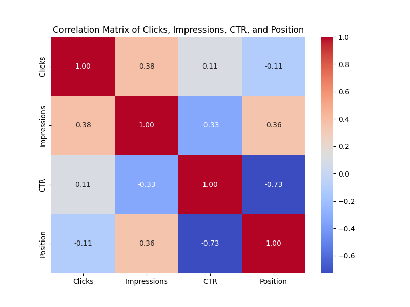

# Z-Score Analysis

## Introduction

Z-Score Analysis is a statistical method utilized for identifying and analyzing outliers or anomalies within a dataset. It involves calculating the Z-Score for each data point, which measures the deviation of that point from the mean in terms of standard deviations. A high Z-Score indicates that a data point is significantly distant from the mean, suggesting it may be an outlier. Z-Score Analysis is commonly employed in various fields such as finance, quality control, and healthcare to detect unusual observations and investigate potential abnormalities in the data distribution.

The following project uses Z-Score Method for analyzing quries with the hightest or lowest CTRs (Click Through Rates). A detailed description about the dataset will be described later.

## Requirements

To install the required packages, run the following command:

```bash
pip install -r requirements.txt
```

## Dataset Description

The dataset "Queries.csv" contains search queries that lead users to a specific website, along with associated metrics. Here are the details of the columns in the dataset:

```bash
Top Queries:                Actual search terms used by users.
Clicks:                     The number of times users clicked on the website after using the query.
Impressions:                The number of times the website appeared in search results for the query.
CTR (Click Through Rate):   The ratio of clicks to impressions, indicating the effectiveness of the query in leading 
                            users to the website.
Position:                   The average ranking of the website in search results for the query.
```
The goal of the analysis is to detect anomalies in search queries, which are queries that perform significantly differently from the majority. Anomalies can be identified based on metrics such as clicks, impressions, CTR, and search position. Anomaly detection techniques like Z-score analysis or machine learning algorithms can be applied to find these unusual patterns in the dataset.

```bash
Descriptive Statistics:
          Clicks   Impressions     Position
count  1000.0000   1000.000000  1000.000000
mean    172.2750   1939.466000     3.985930
std     281.0221   4856.702605     2.841842
min      48.0000     62.000000     1.000000
25%      64.0000    311.000000     2.010000
50%      94.0000    590.500000     3.120000
75%     169.0000   1582.750000     5.342500
max    5223.0000  73380.000000    28.520000
```

Other statistics of the dataset are also shown during program execution, as well as null values inside the data columns.

## Training and Testing

Run the model.py file after installing the given requirements.

Dataset information composing of null value counts, feature descriptions, and statistics are shown during program execution. After cleaning the dataset, the histogram which is a frequency graph of occureneces of words were shown, followed by other frequency plots. 
Here are the anomalies detected with a Z-Score of threshold 7:

```bash
Anomalies Detected:
                          Top queries  Clicks  Impressions     CTR  Position
0         number guessing game python    5223        14578  0.3583      1.61
1                 thecleverprogrammer    2809         3456  0.8128      1.02
2    python projects with source code    2077        73380  0.0283      5.94
21              classification report     933        39896  0.0234      7.53
34           machine learning roadmap     708        42715  0.0166      8.97
82                           r2 score     367        56322  0.0065      9.33
91     facebook programming languages     346        36055  0.0096      1.58
167               text to handwriting     222        11283  0.0197     28.52
232                    standardscaler     177        39267  0.0045     10.23
858            water quality analysis      56         7359  0.0076     27.56
```

## Graphical Results

.png)
.png)
.png)
.png)
.png)



